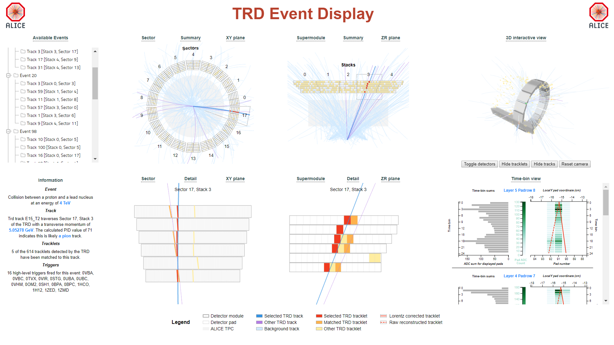

# TRD Event Display

This is a web-based display for event data from the ALICE experiment at CERN, focused on the TRD. Global tracks are displayed along with TRD tracklets, and the corresponding raw data from the TRD detectors can additionally be displayed if available.



## Static use

The simplest way to use the display is to clone the repository (https://github.com/samperumal/alice-js) and then open the `index.static.html` file directly in the browser.

You can customise this with your own data by providing your own static data script. The current script is included on line 10 of file: 

```html
    <!-- Replace this with the path to your own script file, containing json data -->
    <script src="data/pPb/script.js"></script>
```

You can either change this path, or update the existing file.

## Dynamic use

The alternate option is to use a web-server to dynamically serve data files. The simplest way to get started is to clone the repository (https://github.com/samperumal/alice-js) and then startup a Python 3 webserver in the cloned directory as follows:

```bash
python -m http.server
```

You can then open the display in a browser with the url (http://localhost:8000). 

The data for this display is dynamically loaded from a json file, which defaults to `data/sample.json`. You can either replace this with your own appropriately formatted json, or change the load url in `data/script.js`.